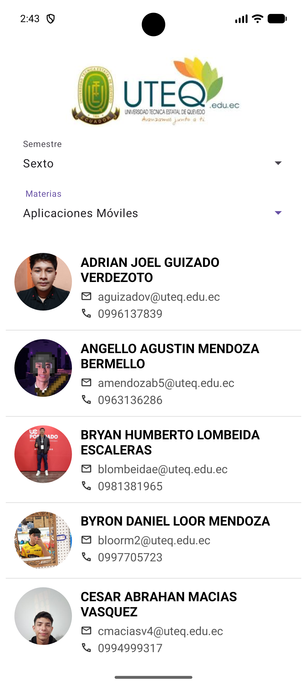

# Gestor de Estudiantes con Supabase

Este proyecto es una aplicación Android nativa diseñada para la gestión y visualización de estudiantes, utilizando **Supabase** como backend en tiempo real.

## Funcionalidades Principales

La aplicación permite navegar a través de los diferentes niveles académicos y consultar la lista de alumnos matriculados en cada materia, integrando datos dinámicos desde la nube.

### Características Técnicas:
*   **Conexión con Supabase SDK:** Implementación de consultas filtradas y ordenadas mediante Postgrest-kt.
*   **Carga Eficiente de Imágenes:** Integración con **Glide** para procesar fotos de perfil con recortes circulares y caché optimizada.
*   **Interfaz de Usuario Adaptable:** Uso de `AutoCompleteTextView` para filtros dinámicos y `ListView` con adaptadores personalizados.
*   **Arquitectura Limpia:** Organización del código en paquetes (Models, Services, Adapters, Utils) para facilitar el mantenimiento.

## Stack Tecnológico
*   **Lenguaje:** Kotlin 2.0+
*   **Base de Datos:** Supabase (PostgreSQL)
*   **Networking:** Ktor & Postgrest-kt
*   **UI Components:** Material Design 3, Glide para imágenes.

---
*Desarrollado como proyecto de integración de servicios en la nube y contenedores UI en Android.*
